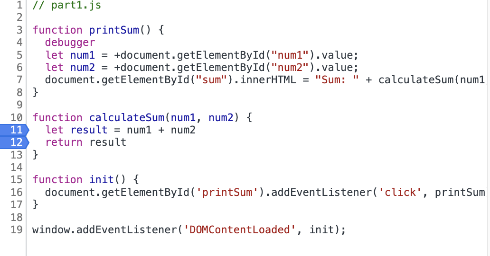
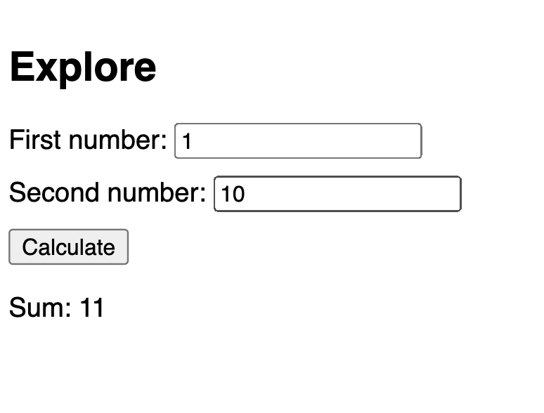

1. The bug was that the user input which was stored in `num1` and `num2` were recognized as strings by `document.getElementByID` instead of integers. So calculateSum concatenated the two values instead of adding the two values as integers. 
2. I fixed the bug by adding a `+` in front of `document.getElementById` which coerces the operand to numbers. 

